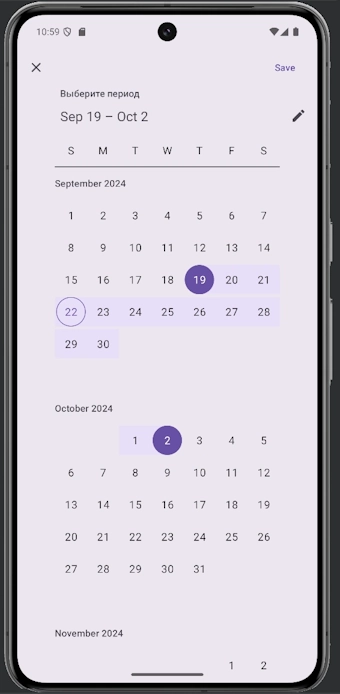

# Vacation Pay Calculator App

### Vacation Pay Calculator is an Android application designed to help users calculate the vacation pay based on the selected range of vacation days and the user’s average salary over the past 12 months. The app provides an easy-to-use interface for selecting date ranges, considering public holidays, and calculating accurate vacation pay.

---

### Features

- Date Range Picker: Select any vacation period using the Material Date Range Picker.

- Public Holiday Adjustment: The app adjusts the vacation pay based on public holidays, automatically excluding them from the total vacation days.

- Instant Calculation: Once the user inputs their average salary and selects the vacation dates, the app calculates the vacation pay instantly.

- Responsive Design: The app maintains user inputs, such as date selections and salary, even after orientation changes.

- User-friendly Interface: Clean and minimalistic UI for seamless user experience.

---

### Technology Stack

- Android SDK: The foundation of the app for building and running it on Android devices.

- Java: Primary language for app development.

- Retrofit: Used for handling network requests to calculate the vacation pay.

- Material Components: For the date range picker and modern UI elements.

- JUnit: Unit testing framework for testing calculation logic and other functionalities.

- Gson: For serializing and deserializing JSON data from API responses.

- ConstraintLayout: For responsive and flexible UI design.

---

### How to Use This Repository

1. Clone the repository to your local machine using the following command:

git clone https://github.com/DT5GEN/vacationMoney.git

2. Open the project in Android Studio.

3. Build the project and ensure all dependencies are installed.

4. Run the app on an emulator or physical device using the Run option in Android Studio.

---

### Screenshots

             

### Future Enhancements

- Multiple Currencies Support: Add support for calculating vacation pay in multiple currencies.

- Different Pay Periods: Option to select different pay periods (weekly, bi-weekly, etc.) for more accurate calculations.

- Historical Public Holidays: Automatic adjustment for public holidays based on country and year.

- Offline Mode: Enable offline calculations without requiring an active internet connection for the API.

- Dark Mode: Add a dark theme option for user comfort.

---

### License

This project is licensed under the MIT License. See the LICENSE file for more details.

